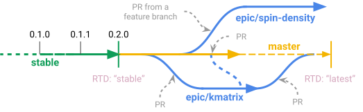

<!--
cSpell:ignore aquirdturtle autobuild docnb dotfiles htmlcov ijmbarr
cSpell:ignore labextension prettierrc prettierignore pylance pylintrc
cSpell:ignore pyrightconfig rstcheck ryantam serverextension testenv
-->

# Develop

[](https://gitpod.io/#https://github.com/ComPWA/PWA-pages)

This page describes some of the tools and conventions followed by the PWA pages
and by {ref}`affiliated PWA software projects <software:Sub-projects>`. Where
possible, we use the
[source code of the PWA-pages repository](https://github.com/ComPWA/PWA-pages)
as example, because its file structure is comparable to that of the others.

::::{tip} To get started, simply run:

:::{tabbed} Conda

```shell
conda env create
conda activate pwa
pre-commit install
```

:::

:::{tabbed} Python venv

```shell
python3 -m venv ./venv
source ./venv/bin/activate
python3 -m pip install -c .constraints/py3.8.txt -e .[dev]
pre-commit install
```

:::

See {ref}`develop:Virtual environment` for more info.

::::

## Local set-up

### Virtual environment

When developing source code, it is safest to work within a
[virtual environment](https://realpython.com/python-virtual-environments-a-primer),
so that all package dependencies and developer tools are safely contained. This
is helpful in case something goes wrong with the dependencies: just trash the
environment and recreate it. In addition, you can easily install other versions
of the dependencies, without affecting other packages you may be working on.

Two common tools to manage virtual environments are
[Conda](https://www.anaconda.com) and
[Python's built-in `venv`](https://docs.python.org/3/tutorial/venv.html). In
either case, you have to activate the environment whenever you want to run the
framework or use the developer tools.

:::{tabbed} Conda environment

[Conda/Anaconda](https://www.anaconda.com) can be installed without
administrator rights, see instructions on
[this page](https://www.anaconda.com/distribution). In addition, Conda can
install more than just Python packages.

All projects {ref}`affiliated with the PWA pages <software:Sub-projects>`
provide a
[Conda environment file](https://docs.conda.io/projects/conda/en/latest/user-guide/tasks/manage-environments.html)
({download}`environment.yml <../environment.yml>`) that defines the minimal
dependencies to run the framework. To create an environment specific for this
package, simply navigate to the main folder of the source code and run:

```shell
conda env create
```

Conda now creates an environment with a name that is defined in the
{file}`environment.yml` file. In addition, it will install the framework in
["editable" mode](#editable-installation), so that you can start developing
right away.

:::

:::{tabbed} Python venv

Alternatively, you can use
[Python's `venv`](https://docs.python.org/3/library/venv.html), if you have
that available on your system. Navigate to some convenient folder and run:

```shell
python3 -m venv ./venv
```

This creates a folder called {file}`venv` where all Python packages will be
contained. To activate the environment, run:

```shell
source ./venv/bin/activate
```

Now you can safely install the package you want to working on, as well as any
dependencies (see ["editable" mode](#editable-installation)):

```shell
pip install -e .
```

:::

### Editable installation

When developing a package, it is most convenient if you install it in
["editable" mode](https://pip.pypa.io/en/stable/reference/pip_install/#editable-installs).
This allows you to tweak the source code and try out new ideas immediately,
because the source code is considered the 'installation'.

With [`pip install`](https://pip.pypa.io/en/stable/reference/pip_install), a
package can be installed in "editable" mode with the
[`-e` flag](https://pip.pypa.io/en/stable/reference/pip_install/#install-editable).
Simply
[clone](https://git-scm.com/book/en/v2/Git-Basics-Getting-a-Git-Repository#_git_cloning)
the repository you want to work on, navigate into it, and run:

```shell
python3 -m pip install -e .
```

:::{toggle}

Internally, this just calls

```shell
python3 setup.py develop
```

:::

This will also install all dependencies required by the package.

### Optional dependencies

Some packages suggest
[optional dependencies](https://setuptools.readthedocs.io/en/latest/userguide/dependency_management.html#optional-dependencies).
They can be installed with
[`pip`'s "extras" syntax](https://packaging.python.org/tutorials/installing-packages/#installing-setuptools-extras).
Some examples would be:

```shell
pip install tensorwaves[jax,scipy]
pip install .[test]  # local directory, not editable
pip install -e .[dev]  #  editable + all dev requirements
```

Developers require several additional tools besides the dependencies required
to run the package itself (see {ref}`develop:Automated coding conventions`).
All those additional requirements can be installed with the last example.

### Pinning dependency versions

To ensure that developers use exactly the same versions of the package
dependencies and developer requirements, some of the repositories provide
[constraint files](https://pip.pypa.io/en/stable/user_guide/#constraints-files).
These files can be used as follows to 'pin' all versions of installed packages:

:::{margin}

Requirements may differ per Python version. Each version of Python therefore
requires a different constraint file.

:::

```shell
python3 -m pip install -c .constraints/py-3.8.txt -e .
```

The syntax works just as well for {ref}`develop:Optional dependencies`:

```shell
python3 -m pip install -c .constraints/py-3.8.txt -e .[doc,sty]
python3 -m pip install -c .constraints/py-3.8.txt -e .[test]
python3 -m pip install -c .constraints/py-3.8.txt -e .[dev]
```

:::{margin}

Constraint files are updated automatically with
[`pip-tools`](https://github.com/jazzband/pip-tools) through
{ref}`develop:GitHub Actions`.

:::

:::{note}

This set-up ensures that the framework _deterministic and reproducible_ (up to
testing) for all commits, which is vital for both users (doing analysis) and
for developers ({ref}`continuous integration <develop:GitHub Actions>`). In
other words, it provides a way out of
["dependency hell"](https://en.wikipedia.org/wiki/Dependency_hell).

:::

### Updating

It may be that new commits in the repository modify the dependencies. In that
case, you have to rerun this command after pulling new commits from the
repository:

```shell
git checkout main
git pull
pip install -c .constraints/py3.8.txt -e .[dev]
```

If you still have problems, it may be that certain dependencies have become
redundant or conflicting. In that case, trash the virtual environment and
{ref}`create a new one <develop:Virtual environment>`.

## Automated coding conventions

Where possible, we define and enforce our coding conventions through automated
tools, instead of describing them in documentation. These tools perform their
checks when you commit files locally (see {ref}`develop:Pre-commit`), when
{ref}`running tox <develop:tox>`, and when you make a
{ref}`pull request <develop:Collaboration>`.

The tools are configured through files such as
[`pyproject.toml`](https://github.com/ComPWA/PWA-pages/blob/main/pyproject.toml),
[`.pylintrc`](https://github.com/ComPWA/PWA-pages/blob/main/.pylintrc), and
[`tox.ini`](https://github.com/ComPWA/PWA-pages/blob/main/tox.ini), and the
workflow files under
[`.github`](https://github.com/ComPWA/PWA-pages/blob/main/.github). If you run
into persistent linting errors, this may mean we need to further specify our
conventions. In that case, it's best to
{ref}`create an issue <develop:Issue management>` or a
{ref}`pull request <develop:Collaboration>` and propose a policy change that
can be formulated through those config files.

### Pre-commit

All {ref}`style checks <develop:Style checks>` are enforced through a tool
called [{command}`pre-commit`](https://pre-commit.com). This tool needs to be
activated, but only once, after you clone the repository:

```shell
pre-commit install
```

```{margin} Initializing pre-commit
The first time you run {command}`pre-commit` after installing or updating its
checks, it may take some time to initialize.
```

Upon committing, {command}`pre-commit` now runs a set of checks as defined in
the file
[{file}`.pre-commit-config.yaml`](https://github.com/ComPWA/PWA-pages/blob/main/.pre-commit-config.yaml)
over all staged files. You can also quickly run all checks over _all_ indexed
files in the repository with the command:

```shell
pre-commit run -a
```

This command is also run on GitHub actions whenever you
{ref}`submit a pull request <develop:Collaboration>`, ensuring that all files
in the repository follow the same conventions as set in the config files of
these tools.

### Tox

More thorough checks can be run in one go with the following command:

```{margin} Running jobs in parallel
The {code}`-p` flag lets the jobs run in parallel. It also provides a nicer
overview of the progress. See {ref}`tox:parallel_mode`.
```

```shell
tox -p
```

This command will [run `pytest`](#testing), perform all
{ref}`style checks <develop:Style checks>`,
{ref}`build the documentation <develop:Documentation>`, and verify
cross-references in the documentation and the API. It's especially recommended
to **run tox before submitting a pull request!**

More specialized {command}`tox` tests are defined in the
{download}`tox.ini <../tox.ini>` config file, under each {code}`testenv`
section. You can list all environments, along with a description of what they
do, by running:

```shell
tox -av
```

Note that {command}`tox` works with its own virtual environments. These
environments install
{ref}`'pinned' dependencies <develop:Optional dependencies>`.

### GitHub Actions

All {ref}`style checks <develop:Style checks>`, testing of the
{ref}`documentation and links <develop:Documentation>`, and
{ref}`unit tests <develop:Testing>` are performed upon each pull request
through [GitHub Actions](https://docs.github.com/en/actions) (see status
overview [here](https://github.com/ComPWA/PWA-pages/actions)). All checks
performed for each PR have to pass before the PR can be merged.

## Style checks

### Formatting

Formatters are tools that automatically format source code, or some document.
Naturally, this speeds up your own programming, but these tools are
particularly important when {ref}`collaborating <develop:Collaboration>`,
because a standardized format avoids line conflicts in Git.

For the Python source code, we use [`black`](https://black.readthedocs.io) and
[`isort`](https://isort.readthedocs.io). For other code, we use
[Prettier](https://prettier.io). All of these formatters are "opinionated
formatters": they offer only limited configuration options as, to make
formatting as conform as possible.

{ref}`develop:Pre-commit` automatically strips Jupyter notebook of any output
cells. Notebook cells can be formatted with
[`jupyterlab-code-formatter`](https://jupyterlab-code-formatter.readthedocs.io).
See more info at {ref}`develop:Jupyter Notebooks`.

### Linting

Linters point out when certain style conventions are not correctly followed.
Unlike with {ref}`formatters <develop:Formatting>`, you have to fix the errors
yourself.

As mentioned in {ref}`develop:Automated coding conventions`, style conventions
are formulated in config files. For linters, we use the following:

- {download}`.cspell.json <../.cspell.json>`
  - [cSpell: spell checker for code](https://github.com/streetsidesoftware/cspell/tree/master/packages/cspell)
- {download}`.markdownlint.json <../.markdownlint.json>`
  - [markdownlint](https://github.com/DavidAnson/markdownlint)
- {download}`pyproject.toml <../pyproject.toml>`
  - {ref}`black <develop:Formatting>`
  - {ref}`isort <develop:Formatting>`
- {download}`.mypy.ini <../.mypy.ini>`
  - [mypy](http://mypy-lang.org)
- {download}`.prettierrc <../.prettierrc>`
  - [Prettier](https://prettier.io)
- {download}`pyrightconfig.json <../pyrightconfig.json>`
  - [Pylance](https://marketplace.visualstudio.com/items?itemName=ms-python.vscode-pylance)
  - [Pyright](https://github.com/microsoft/pyright)
- {download}`tox.ini <../tox.ini>`
  - [flake8](https://flake8.pycqa.org)
  - [pydocstyle](https://pydocstyle.pycqa.org)
  - [pytest](https://docs.pytest.org)

:::{toggle}

```{note}
As an illustration of automated checks, we list the files here with links to
the actual files as to ensure that these files still exist and that
this documentation remains up to date.
```

:::

### Spelling

Throughout this repository, we follow American English
([en-us](https://www.andiamo.co.uk/resources/iso-language-codes)) spelling
conventions. As a tool, we use
[cSpell](https://github.com/streetsidesoftware/cspell/blob/master/packages/cspell/README.md),
because it allows to check variable names in camel case and snake case. This
way, a spelling checker helps you avoid mistakes in the code as well! cSpell is
enforced through pre-commit.

Accepted words are tracked through the
{download}`.cspell.json <../.cspell.json>` file. As with the other config
files, {download}`.cspell.json <../.cspell.json>` formulates our conventions
with regard to spelling and can be continuously updated while our code base
develops. In the file, the `words` section lists words that you want to see as
suggested corrections, while `ignoreWords` are just the words that won't be
flagged. Try to be sparse in adding words: if some word is just specific to one
file, you can [ignore it inline](https://www.npmjs.com/package/cspell#ignore),
or you can add the file to the `ignorePaths` section if you want to ignore it
completely.

It is easiest to use cSpell in {ref}`develop:Visual Studio Code`, through the
[Code Spell Checker](https://marketplace.visualstudio.com/items?itemName=streetsidesoftware.code-spell-checker)
extension: it provides linting, suggests corrections from the {code}`words`
section, and enables you to quickly add or ignore words through the
{file}`.cspell.json` file.

## Testing

The fastest way to run all tests is with the command:

```shell
pytest -n auto
```

The flag {command}`-n auto` causes {code}`pytest` to
[run with a distributed strategy](https://pypi.org/project/pytest-xdist).

:::{margin}

```{tip}
In VScode, you can
visualize test coverage are covered with
[Coverage Gutters](https://marketplace.visualstudio.com/items?itemName=ryanluker.vscode-coverage-gutters).
For this you need to run {command}`pytest` with the flag
{command}`--cov-report=xml`).
```

:::

Try to keep test coverage high. You can compute current coverage by running

```shell
tox -e cov
```

and opening {file}`htmlcov/index.html` in a browser.

To get an idea of performance per component, run

```shell
pytest --profile-svg
```

and check the stats and the {file}`prof/combined.svg` output file.

```{dropdown} Organizing unit tests
When **unit** tests are well-organized, you avoid writing duplicate tests. In
addition, it allows you to check for coverage of specific parts of the code.

Therefore, when writing new tests, try to follow the module and class structure
of the package. For example, put unit tests that test the functions and methods
defined of some module called {code}`package.module` module into a test file
called {file}`test_module.py` that is directly placed under the {file}`tests`
folder. Similarly, bundle for a class {code}`SomeClass` under a
{code}`TestSomeClass` class in that file and test its methods (say,
{code}`SomeClass.my_method`) with `TestSomeClass.test_my_method`.

If possible, also try to order the tests by alphabetical order (that is, the
order of the {code}`import` statements).
```

```{note}
Jupyter notebooks can also be used as tests. See more info
{ref}`here <develop:Jupyter Notebooks>`.
```

## Documentation

The documentation that you find on [pwa.rtfd.io](https://pwa.rtfd.io) and its
sub-projects is built with [Sphinx](https://www.sphinx-doc.org). Sphinx also
[builds the API page](https://www.sphinx-doc.org/en/master/man/sphinx-apidoc.html)
of the packages and therefore checks whether the
[docstrings](https://www.python.org/dev/peps/pep-0257) in the Python source
code are valid and correctly interlinked.

You can quickly build the documentation from the root directory of any of the
repositories with the command:

```shell
tox -e doc
```

:::{toggle}

Alternatively, you can run `sphinx-build` yourself as follows:

```shell
cd docs
make html
```

:::

If you are doing a lot of work on the documentation,
[`sphinx-autobuild`](https://pypi.org/project/sphinx-autobuild) is a nice tool
to use. Just run:

```shell
tox -e doc-live
```

This will start a server [http://127.0.0.1:8000](http://127.0.0.1:8000) where
you can continuously preview the changes you make to the documentation.

### Documentation preview

A nice feature of [Read the Docs](https://readthedocs.org), where we host our
documentation, is that documentation is built for each pull request as well.
This means that you can view the documentation for your changes as well. For
more info, see
[here](https://docs.readthedocs.io/en/stable/guides/autobuild-docs-for-pull-requests.html),
or just click "details" under the RTD check once you submit your PR.

We make use of [Markedly Structured Text](https://myst-parser.readthedocs.io)
(MyST), so you can write the documentation in either
[reStructuredText](https://www.sphinx-doc.org/en/master/usage/restructuredtext/basics.html)
or [Markdown](https://www.markdownguide.org). In addition, it's easy to write
(interactive) code examples in Jupyter notebooks and host them on the website
(see [MyST-NB](https://myst-nb.readthedocs.io))!

### Jupyter Notebooks

:::{margin}

```{tip}
Sometimes it happens that your Jupyter installation does not recognize your
{ref}`virtual environment <develop:Virtual environment>`. In that case, have a
look at
[these instructions](https://ipython.readthedocs.io/en/stable/install/kernel_install.html#kernels-for-different-environments)
```

:::

The [docs](https://github.com/ComPWA/PWA-pages/tree/main/docs) folder contains
a few Jupyter notebooks. These notebooks are run and tested whenever you make a
{ref}`pull request <develop:Collaboration>`. If you want to improve those
notebooks, we recommend working with
[Jupyter Lab](https://jupyterlab.readthedocs.io/en/stable), which is
{ref}`installed with the dev requirements <develop:Optional dependencies>`.
Jupyter Lab offers a nicer developer experience than the default Jupyter
notebook editor does.

In addition, we recommend to install a few extensions:

```shell
jupyter labextension install jupyterlab-execute-time
jupyter labextension install @ijmbarr/jupyterlab_spellchecker
jupyter labextension install @aquirdturtle/collapsible_headings
jupyter labextension install @ryantam626/jupyterlab_code_formatter
jupyter labextension install @jupyter-widgets/jupyterlab-manager

jupyter serverextension enable --py jupyterlab_code_formatter
```

Now, if you want to test all notebooks in the documentation folder and check
what their output cells will look like in the {ref}`develop:Documentation`, you
can do this with:

```shell
tox -e docnb
```

This command takes more time than `tox -e doc`, but it is good practice to do
this before you submit a pull request.

## Collaboration

The source code of all related repositories is maintained with
[Git](https://git-scm.com) and [GitHub](https://github.com). We keep track of
issues with the code, documentation, and developer set-up with GitHub issues
(see for instance [here](https://github.com/ComPWA/PWA-pages/issues)). This is
also the place where you can
[report bugs](https://github.com/ComPWA/PWA-pages/issues/new/choose).

### Issue management

We keep track of issue dependencies, time estimates, planning, pipeline
statuses, et cetera with [ZenHub](https://app.zenhub.com). You can use your
GitHub account to log in there and automatically get access to the issue boards
of the packages once you are part of the
[ComPWA organization](https://github.com/ComPWA).

Publicly available are:

- [Issue labels](https://github.com/ComPWA/PWA-pages/labels): help to
  categorize issues by type (maintenance, enhancement, bug, etc.).

- [Milestones](https://github.com/ComPWA/PWA-pages/milestones?direction=asc&sort=title&state=open):
  way to bundle issues for upcoming releases.

- [Releases](https://github.com/ComPWA/PWA-pages/releases) (see
  {ref}`develop:Milestones and releases`)

### Branching model

While our aim is to maintain long-term, stable projects,
{ref}`PWA software projects <software:Sub-projects>` are academic projects that
are subject to change and often require swift modifications or new features for
ongoing analyses. For this reason, we work in different layers of development.
These layers are represented by Git branches.



#### `stable` branch

Represents the _latest release_ of the package that can be found on both the
GitHub release page and on PyPI (see {ref}`develop:Milestones and releases`).
The documentation of the `stable` branch is also the default view
{ref}`you see on Read the Docs <develop:Documentation>` (RTD). See e.g.
[expertsystem.rtfd.io/en/stable](https://expertsystem.rtfd.io/en/stable).

(main-branch)=

#### `main` branch

Represents the upcoming release of the package. This branch is not guaranteed
to be stable, but has high {ref}`CI standards <develop:GitHub Actions>` and can
only be updated through reviewed pull requests. The documentation of the `main`
branch can be found on RTD under "latest", see e.g.
[expertsystem.rtfd.io/en/latest](https://expertsystem.rtfd.io/en/latest).

#### Epic branches

```{margin}
The word ["epic"](https://www.atlassian.com/agile/project-management/epics) is
used in
[agile software development](https://en.wikipedia.org/wiki/Agile_software_development).
```

When working on a feature or larger refactoring that may take a longer time
(think of implementing a new PWA formalism), we isolate its development under
an 'epic branch', separate from the `main` branch. Eventually, this epic branch
is to be merged back into the `main`, until then it is available for discussion
and testing.

Pull requests to an epic branch require no code review and the CI checks are
less strict. This allows for faster development, while still offering the
possibility to discuss new implementations and
{ref}`keeping track of related issues <develop:Issue management>`.

Epic branches can be installed through PyPI as well. Say that a certain epic is
located under the branch `epic/some-title` and that the source code is located
under
[https://github.com/ComPWA/expertsystem](https://github.com/compwa/expertsystem),
it can be installed as follows:

```shell
python3 -m pip install git+https://github.com/ComPWA/expertsystem@epic/some-title
```

#### Feature branches

The {ref}`main-branch` and {ref}`develop:epic branches` can be updated through
pull requests. It is best to create such a pull request from a separate branch,
which does not have any CI or code review restrictions. We call this a "feature
branch".

### Commit conventions

- Please use
  [conventional commit messages](https://www.conventionalcommits.org): start
  the commit with a semantic keyword (see e.g.
  [Angular](https://github.com/angular/angular/blob/master/CONTRIBUTING.md#type)
  or
  [these examples](https://seesparkbox.com/foundry/semantic_commit_messages)),
  followed by [a column](https://git-scm.com/docs/git-interpret-trailers), then
  the message. The message itself should be in imperative mood — just imagine
  the commit to give a command to the code framework. So for instance:

  ```none
  ci: implement coverage report tools
  fix: fix typo in raised ValueError
  chore: remove redundant print statements
  docs!: rewrite welcome pages
  ```

- Keep pull requests small. If the issue you try to address is too big, discuss
  in the team whether the issue can be converted into an
  [Epic](https://blog.zenhub.com/working-with-epics-in-github) and split up
  into smaller tasks.

- Before creating a pull request, run `tox`. See also {ref}`develop:Tox`.

- Also use a [conventional commit message](https://www.conventionalcommits.org)
  style for the PR title. This is because we follow a
  [linear commit history](https://docs.github.com/en/github/administering-a-repository/requiring-a-linear-commit-history)
  and the PR title will become the eventual commit message. Note that a
  conventional commit message style is
  {ref}`enforced through GitHub Actions <develop:GitHub Actions>`, as well as a
  check on {ref}`PR labels <develop:Issue management>` (see overview
  [here](https://github.com/ComPWA/PWA-pages/actions?query=workflow%3A%22PR+linting%22)).
  The corresponding configuration file is
  {download}`commitlint.config.js <../commitlint.config.js>`.

- PRs can only be merged through 'squash and merge'. There, you will see a
  summary based on the separate commits that constitute this PR. Leave the
  relevant commits in as bullet points. See the
  [commit history](https://github.com/ComPWA/PWA-pages/commits/main) for
  examples. This comes in especially handy when
  {ref}`drafting a release <develop:Milestones and releases>`!

### Milestones and releases

Releases are managed with the
[GitHub release page](https://docs.github.com/en/free-pro-team@latest/github/administering-a-repository/managing-releases-in-a-repository),
see for instance
[the one for the PWA pages](https://github.com/ComPWA/PWA-pages/releases).

Release notes are
[automatically generated from the PRs](https://github.com/release-drafter/release-drafter)
that were merged into the main branch since the previous tag. The changelog
there is generated from the PR titles and categorized by issue label. New
releases are automatically published to PyPI when a new tag with such release
notes is created (see
[setuptools-scm](https://pypi.org/project/setuptools-scm)).

## Code editors

### Visual Studio code

We recommend using [Visual Studio Code](https://code.visualstudio.com) as it's
free, regularly updated, and very flexible through it's wide offer of user
extensions.

If you add or open this repository as a
[VSCode workspace](https://code.visualstudio.com/docs/editor/multi-root-workspaces),
the file {download}`.vscode/settings.json <../.vscode/settings.json>` will
ensure that you have the right developer settings for this repository. In
addition, VSCode will automatically recommend you to install a number of
extensions that we use when working on this code base.
[They are defined](https://code.visualstudio.com/updates/v1_6#_workspace-extension-recommendations)
in the {download}`.vscode/extensions.json <../.vscode/extensions.json>` file.

You can still specify your own settings in
[either the user or encompassing workspace settings](https://code.visualstudio.com/docs/getstarted/settings),
as the VSCode settings that come with this are folder settings.

:::{dropdown} Conda and VSCode

Projects related to the PWA pages are best developed
{ref}`with Conda <develop:Virtual environment>` and VSCode. The complete
developer install procedure then becomes:

```shell
git clone https://github.com/ComPWA/PWA-pages.git  # or some other repo
cd PWA-pages
conda env create
conda activate pwa  # or whatever the name is
code .  # open folder in VSCode
```

:::
